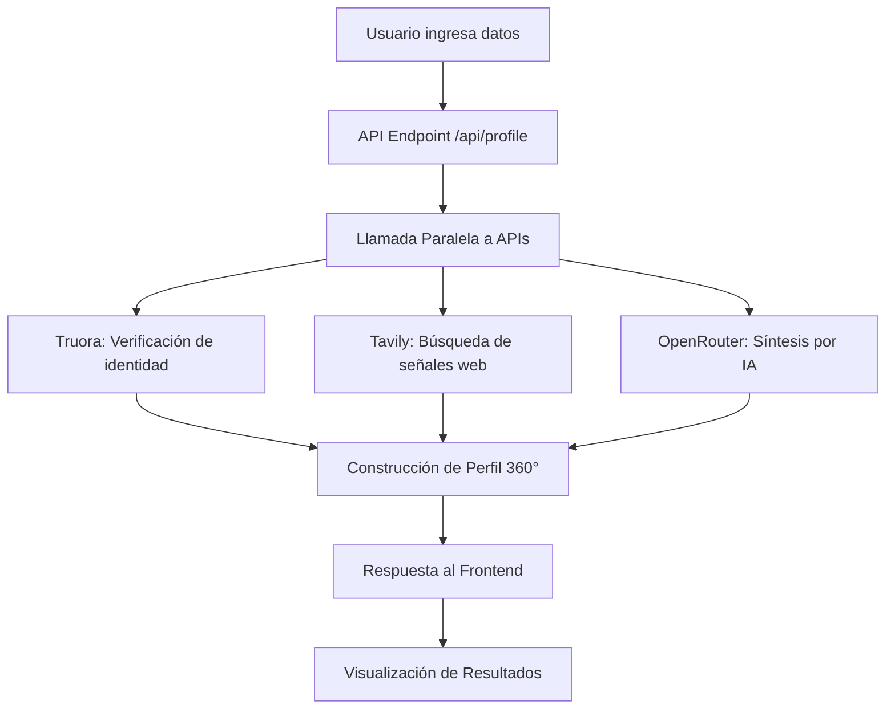

# Perfiles de Identidad 360°

Una aplicación Next.js que crea perfiles comprehensivos de identidad combinando múltiples fuentes de datos para evaluación de riesgo crediticio.

## 🚀 Características

- **Integración de APIs externas**: Combina datos de Truora (verificación de identidad), Tavily (búsqueda web) y OpenRouter (síntesis por IA)
- **Análisis de riesgo en tiempo real**: Genera scores y niveles de riesgo basados en múltiples fuentes
- **Interfaz responsive y accesible**: Diseño limpio con Tailwind CSS
- **Manejo robusto de errores**: Feedback claro para diferentes tipos de fallos
- **Mock realista**: Simulación detallada para desarrollo y demostración sin consumir créditos de API

## 🛠️ Tecnologías Utilizadas

- **Frontend**: Next.js 16.2.3, React 19.2.4, TypeScript, Tailwind CSS 4
- **APIs Integradas**: Truora, Tavily, OpenRouter
- **Estado**: React hooks (useState)
- **Despliegue**: Optimizado para Vercel

## 🔧 Configuración Local

1. Clona el repositorio:
   ```bash
   git clone https://github.com/tu-usuario/identidad-360.git
   cd identidad-360
   ```

2. Instala dependencias:
   ```bash
   npm install
   ```

3. Crea un archivo `.env.local` basado en `.env.example`:
   ```bash
   cp .env.example .env.local
   ```

4. Obtén las API keys necesarias:
   - **Truora**: Regístrate en [truora.com](https://www.truora.com) para obtener tu API key
   - **Tavily**: Regístrate en [tavily.com](https://tavily.com) para obtener tu API key
   - **OpenRouter**: Regístrate en [openrouter.ai](https://openrouter.ai) para obtener tu API key

5. Configura tus claves en `.env.local`:
   ```env
   TRUORA_API_KEY=tu_clave_real_aqui
   TAVILY_API_KEY=tu_clave_real_aqui
   OPENROUTER_API_KEY=tu_clave_real_aqui
   TRUORA_MOCK=false  # Cambia a true si quieres usar mock
   ```

6. Inicia el servidor de desarrollo:
   ```bash
   npm run dev
   ```

7. Abre [http://localhost:3000](http://localhost:3000) en tu navegador

## 📚 ¿Cómo Funciona?

### Arquitectura de Integración de APIs



### Flujo de Datos

1. **Frontend**: El usuario ingresa nombre, país y documento de identidad
2. **API Route** (`/app/api/profile/route.ts`):
   - Valida los datos de entrada
   - Llama en paralelo a las tres APIs externas
   - Combina los resultados en un perfil coherente
   - Devuelve la respuesta estructurada
3. **Frontend**: Muestra los resultados con visualizaciones claras por fuente de datos

## 🎯 Lo Que Aprendí

Durante el desarrollo de este proyecto, profundicé en:

### Integración de APIs Externas
- Manejo de autenticación con headers personalizados (Truora-API-Key)
- Manejo de límites de tasa y errores de red
- Combinación de respuestas de múltiples fuentes con diferentes formatos
- Implementación de timeouts y reintentos básicos

### Arquitectura de Next.js
- Uso de API Routes para mantener las claves de API seguras en el backend
- Separación de preocupaciones entre frontend y backend
- Tipado sólido con TypeScript para interfaces de API
- Optimización de carga con `useState` y manejo de loading states

### Diseño de Experiencia de Usuario
- Feedback visual claro durante las llamadas a API
- Manejo graceful de errores parciales (cuando una API falla pero otras funcionan)
- Visualización diferenciada por fuente de datos (Truora, Tavily, IA)
- Diseño responsive accesible

## 📁 Estructura del Proyecto

```
identidad-360/
├── app/                     # Directorio de Next.js App Router
│   ├── api/                 # Endpoints de API
│   │   └── profile/         # Ruta para construcción de perfiles
│   ├── page.tsx             # Página principal
│   └── layout.tsx           # Layout raíz
├── components/              # Componentes reutilizables
│   ├── Chip.tsx             # Chip de estado (éxito/error)
│   ├── RiskBadge.tsx        # Indicador de nivel de riesgo
│   └── SourceList.tsx       # Lista de fuentes consultadas
├── lib/                     # Lógica de negocio y servicios
│   ├── truora.ts            # Cliente para API de Truora
│   ├── tavily.ts            # Cliente para API de Tavily
│   ├── openrouter.ts        # Cliente para API de OpenRouter
│   └── synthesizer.ts       # Lógica para combinar resultados
├── public/                  # Assets estáticos
├── styles/                  # Estilos globales
└── .env.local               # Variables de entorno (no versionado)
```

## 🚀 Despliegue en Vercel

1. Haz push de tu repositorio a GitHub
2. Importa el proyecto en [Vercel](https://vercel.com)
3. Configura las variables de entorno en el panel de Vercel:
   - `TRUORA_API_KEY`
   - `TAVILY_API_KEY`
   - `OPENROUTER_API_KEY`
   - `TRUORA_MOCK` (opcional, default: false)
4. Vercel detectará automáticamente que es un proyecto Next.js y lo desplegará

## 🧪 Pruebas y Demostración

Para probar sin consumir créditos de API:
1. Mantén `TRUORA_MOCK=true` en tu `.env.local`
2. El proyecto usará simulaciones realistas que varían según la entrada
3. Prueba con diferentes nombres y documentos para ver diferentes perfiles de riesgo

## 📝 Licencia

Este proyecto está bajo la Licencia MIT - ver el archivo [LICENSE](LICENSE) para más detalles.

## 💡 Mejoras Futuras

- [ ] Añadir tests unitarios y de integración
- [ ] Implementar caching de respuestas para mejorar performance
- [ ] Añadir historial de búsquedas
- [ ] Exportar perfiles a PDF
- [ ] Implementar autenticación de usuarios
- [ ] Añadir visualizaciones avanzadas de datos